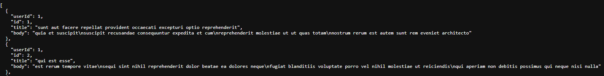

# Fundamentos de Angular

O Angular é um framework desenvi=olvido para fazer Single Page Application (SPA).
As SPA são fragmentadas em seções **(componentes)**.
Para cada componente da página o Angular cria 4 arquivos:

* HTML
* CSS
* TS (Typescript)
* Teste

## Instalando o Angular

* Instalar o NODEJS.
* Instalar o Angular.

> [!TIP] 
> **npm install -g @angular/cli**

* O Angular funciona a partir do prefixo **ng**.

> [!TIP]
> **ng new** \
> Cria um novo projeto Angular.

## Estrutura do projeto

### Criar projeto

> [!TIP]
> npm install **"nome do projeto"**\
> Exemplo: npm install projeto1

Os arquivos dentro da pasta `App`

* `app.component.css`
* `app.component.html`
* `app.component.spec.ts`
* `app.component.ts`

são responsáveis pela renderização da página principal.

> [!WARNING]
> A partir da versão 18 do Angular não existe mais o arquivo `app.module.ts` e `app-routing.module.ts`\
> Os componetes, bem como as rotas, devem ser importados/configurados diretamente para o arquivo `.ts` de cada componente.

### Iniciar uma aplicação Angular

> [!TIP]
> npm install serve -o

* O comando `ng serve` inicia o servidor do Angular.
* O parâmetro `-o` abre o projeto no navegador.

## Componentes

### Criando componentes

O Angular cria componentes em pastas dentro da pasta `App`. Para melhor organização pode fazer uma subpasta `Componentes`.

> [!TIP]
> `ng generate(g) component(c) componentes/cabecalho` ou\
> `ng g c componentes/cabecalho`

* **componetes** = subpasta.
* **cabecalho** = nome do componente.

> [!NOTE]
> São criados os arquivos
>
> * `cabecalho.component.css`
> * `cabecalho.component.html`
> * `cabecalho.component.spec.ts`
> * `cabecalho.component.ts`

No `app.component.html` referenciar os componentes que deseja redenrizar, através das respectivas TAGs.

```html
<app-cabecalho></app-cabecalho>
<router-outlet></router-outlet>
<app-rodape></app-rodape>
```

```typescript
// Arquivo: app.routes.ts

import { Routes } from '@angular/router';
import { ConteudoComponent } from './componentes/conteudo/conteudo.component';
import { Componente1Component } from './componentes/componente1/componente1.component';
import { Componente3Component } from './componentes/componente3/componente3.component';
import { Componente2Component } from './componentes/componente2/componente2.component';
import { RotacustomComponent } from './componentes/rotacustom/rotacustom.component';

export const routes: Routes = [
    {path: '', component: ConteudoComponent},
    {path: 'link1', component: Componente1Component},
    {path: 'link2', component: Componente2Component},
    {path: 'link3', component: Componente3Component},
    {path: 'custom/:id', component: RotacustomComponent}
];
```

### Criando as rotas dos componentes

Em `app.routes.ts`, na `const routes`, criar objetos com 2 atributos:

* **Path:** indica a rota do endereço URL.
* **Component:** especifica o componente que será renderizado.

```typescript
export const routes: Routes = [
    {path: '', component: ConteudoComponent},
    {path: 'link1', component: Componente1Component},
    {path: 'link2', component: Componente2Component},
    {path: 'link3', component: Componente3Component},
];
```

## Links

### Atribuindo rotas à TAG de link `<a>`

Para que as rotas funcione deve-se substituir o parâmentro `href` por `routerLink`.

A tag link (`<a>`) deve ficar assim:

```html
<a routerLink="/">Cabecalho</a>
```

* O atributo **routerLink** especifica a rota para o componente desejado.

> [!IMPORTANT]
> O **routerLink** deve ser importando no arquivo `.TS` do componente.

```typescript
import { RouterLink } from '@angular/router';

@Component({
  selector: 'app-cabecalho',
  standalone: true,
  imports: [RouterLink],
  templateUrl: './cabecalho.component.html',
  styleUrl: './cabecalho.component.css'
})
export class CabecalhoComponent{
}
```

No `app.component.html` trocar o componente que se quer renderizar por

* `<router-outlet></router-outlet>`

O **`router-outlet`** é o ponto de centralização e consulta das URLs e os respectivos componentes associados às rotas.

```html
<app-cabecalho></app-cabecalho> // renderiza o cabeçalho
<router-outlet></router-outlet> // renderiza o body (tag que foi trocada)
<app-rodape></app-rodape> // renderiza o rodapé
```

## Interpolação, Event e Property Binding

### OnInit

O `OnInit` é o elemento do componente onde podemos trabalhar quando este componete é criado e inicializado para ser renderizado.

* A classe do componente deve **implementar** o `OnInit`

```typescript
export class ConteudoComponent implements OnInit {
  
  // ATRIBUTOS
  public mensagem:string;
  public valor:number;
  public clicado: boolean;
  
  //CONSTRUTOR
  public constructor(){
    this.mensagem = "Olá, Mundo!";
    this.valor=0;
    this.clicado=false;
  }

  // necessário para implementar o OnInit
  ngOnInit(): void {
  }
  
  //MÉTODOS
  public mudarValor(){
    this.valor++;
  }

  public enviarDados(){
    console.log(this.textoForm + "/" + this.senha + "/" + this.clicado);
  }

}
```

> [!IMPORTANT]
> A implementação do OnInit necessitar implementar o método `ngOnInit()`.

### Interpolação

Com a interpolação conseguimos renderizar uma variável presente no `Typescript` no `HTML`. Permite mostrar uma variável no HTML.

* Sintaxe `{{nome da variável}}`

```html
<h1>Conteúdo. Mensagem ={{mensagem}}</h1>
```

### Event binding

Event binding é a associação de eventos. Usamos este recurso para vincular um código da aplicação a um certo evento disparado pelo navegador.

* Sintaxe: `(tipo do evento)= "método chamado"`.

```typescript
<button (click)="incrementa()" >Mudar valor</button>
```

> [!IMPORTANT]
> O operador `()` indica que há uma comunicação do  HTML para o Typescript.\
> O que for indicado no evento do angular, ele vai procurar no Typescript se existe a declaração conrrespondente.

### Property Binding

O **property binding** é uma forma de associar propriedades entre o `template` (arquivo html) e o `component` (arquivo typescript). Essa associação pode ser feita utilizando a sintaxe dos colchetes ou das chaves duplas (interpolação).

* Ao usar o operador `[]` nos parâmetros das TAG é possível associar a um nome de variável do Typscript.

```typescript
//Arquivo: conteudo.component.ts

export class ConteudoComponent implements OnInit {
  public link_foto: string;
  public constructor(){
      this.link_foto= "../../../../public/agronomia_logotipo.png"
  }

//Arquivo: conteudo.component.html


```

> [!CAUTION]
>
> * Usar `Interpolação` quando for colocar a variável no corpo (texto interno) de uma TAG.
> * Usar `Propety` quando querer mudar atributos de uma TAG a partir de uma variável.

## Formulários

* Importar o `FormsModule` para o arquivo `.ts` do componente.

```typescript
import { FormsModule } from '@angular/forms';

@Component({
  selector: 'app-conteudo',
  standalone: true,
  imports: [FormsModule],
  templateUrl: './conteudo.component.html',
  styleUrl: './conteudo.component.css'
})
```

* Sintaxe: `[(ngModel)]="nome da variável"`.

```html
//Arquivo: conteudo.compoment.html

<input type="text"  id="meuTxt" [(ngModel)]="textoForm">
<input type="password" id="minhaSenha" [(ngModel)]="senha"><br>
<input type="checkbox"[(ngModel)]="clicado" >Cliqui aqui <br>
<button (click)="enviarDados()">Enviar dados</button>
```

> [!CAUTION]
> Não utilizar a TAG `form`, pois a mesma renderizar a página sempre que o botâo `submit` é acionado.

* Todo campo do formulário precisa estar associada a uma variável dentro do componente.

```typescript
//Arquivo: conteudo.component.ts
export class ConteudoComponent implements OnInit {
  //ATRIBUTOS
  public textoForm: string;
  public senha: string;
  public clicado: boolean;
  //CONSTRUTOR
  public constructor(){
    this.textoForm="";
    this.senha="";
    this.clicado=false;
  }
  //MÉTODOS
  public enviarDados(){
    console.log(this.textoForm + "/" + this.senha + "/" + this.clicado);
  }
}
```

O ngModel vai pegar o conteúdo do campo. O operador `[()]` vai fazer o binding (ligação) do campo `html` com a variável do `.ts`.

```html
<input type="password" id="minhaSenha" [(ngModel)]="senha">
```

## Typescript

Para instalar o Typescript utilizar o comando:

* `npm install typescript`

## Rotas

### Tipos de rotas

* Rotas acionadas a partir de algum evento (via código).
* Rotas parametrizáveis. Montar a URL com o componente de rota sendo parametrizado a partir do código.

No `app.routes.ts` o componente dever ser informado com um parâmentro (`:nome do parâmetro`).

```typescript
import { RotacustomComponent } from './componentes/rotacustom/rotacustom.component';

export const routes: Routes = [
    {path: 'custom/:id', component: RotacustomComponent}
];
```

#### ActivatedRoute

No arquivo `.ts` do componente é necessário injetar o componente **`ActivatedRoute`**.

* `ActivatedRoute` pega a rota que está ativa no momento.

```typescript
//Arquivo rotacustom.component.ts
import { Component, OnInit } from '@angular/core';
import { ActivatedRoute, Router } from '@angular/router';

@Component({
  selector: 'app-rotacustom',
  standalone: true,
  imports: [],
  templateUrl: './rotacustom.component.html',
  styleUrl: './rotacustom.component.css'
})
export class RotacustomComponent implements OnInit {
  public idREcebido: string = "";
    
  //CONSTRUTOR com o ActivatedRoute o Router injetado.
  public constructor(private activatedRoute: ActivatedRoute, private router: Router) {
  }
  public ngOnInit(): void {
    this.idREcebido = this.activatedRoute.snapshot.params['id'];
    console.log("Ide recebido na rota = " + this.idREcebido)
  }
  public navegar(): void {
    this.router.navigate(['/'])
  }
}
```

* No `ngOnInit()` do componente o `this.activatedRoute.snapshot.params['id']` captura o estado atual da rota, capturando o parâmetro a partir do nome (`id`).

* Atribuir a uma variável. `this.idREcebido` = `this.activatedRoute.snapshot.params['id'];`

#### Router

* O **`Router`** permite fazer navegações. Deve ser injetado no arquivo `.ts` igual ao `ActivatedRoute`.

O componente navigate dá um vetor de comandos para fazer rotas.

> [!NOTE]
> O `router.navigate([''])` funciona exatamento como o `routerLink`, porém o routerLink é um atributo da TAG (**`a`**) e o objeto Router (injetado no componente typescript) permiter fazer rotas via código.

* Sintaxe: `.navigate(['rota'])`

```typescript
public navegar(): void {
    this.router.navigate(['/'])
  }
```


> [!TIP]
>
> * O `Router` permite navegar
>
> * O `ActivatedRoute` permite capturar o que está ativo na rota.

### Parâmentros da URL

* São os parâmetros que vem após a `?` na URL.

```typescript
public constructor(private activetedRoute: ActivatedRoute){
    let p1: string;
    let p2: string;
    
    p1= this.activetedRoute.snapshot.queryParams['p1'];
    p2 = this.activetedRoute.snapshot.queryParams['p2'];

    console.log("p1 = " + p1);
    console.log("p2 = " + p2);

  }
```

* O `queryParams['nome do parâmentro']` captura o paramentro da URL.

```html
 <a routerLink='/link1'[queryParams]="{p1:'abc', p2: 'xuas'}">Link1</a>
```

* `"{p1:'abc', p2: 'xuas'}"` é um objeto **JSON** composto de `chave:valor`, separados por vígula.

URL: http://localhost:4200/link1?p1=abc&p2=xuas

> [!IMPORTANT]
> O **`RouterLink`** deve ser importado para o componente para que o `[queryParams]` funcione.

## Consumo de API

Em `app.config.ts` importar **`provideHttpClient`**.

```typescript
import { provideHttpClient } from '@angular/common/http';

export const appConfig: ApplicationConfig = {
  providers: [provideZoneChangeDetection({ eventCoalescing: true }), provideRouter(routes), provideHttpClient()]
};
```

* Levar em considferação a estrutura do JSON.


* Para fazer consumo de API, precisamos criar um tipo de dado compatível com a estrutura do JSON.

* Criar um pasta para por os **Models** do JSON.
* Criar um arquivo (`Post.ts`) para definir a estrutura.

```typescript
export class Post {
    public userId: number;
    public id: number;
    public title: string;
    public body: string;
    
    public constructor(){
        this.userId=0;
        this.id=0;
        this.title="";
        this.body="";
    }
}
```

> [!NOTE]
> Em vez do construtor, pode ser declarado a variável já inicializada.\
> Ex: **`public userId: number = 0`**;

* Os arquivos `Typescript` terão utilidade exclusivamente para fazer a comunicação entre o protocolo da **API** e o **Front-end**.

### Criar um serviço que consome o componente HTTP

* Criar o serviço:\
`ng g service servicos/post`

* Será criado um arquivo **`post.service.ts`** na pasta servicos.

* Todo método de um serviço que utiliza o componente `HttpClient` retorna um objeto do tipo **`Observable`**.

```typescript
import { HttpClient } from '@angular/common/http';
import { Injectable } from '@angular/core';
import { Observable } from 'rxjs';
import { Post } from '../Model/Post';

@Injectable({
  providedIn: 'root'
})
export class PostService {

  constructor(private http:HttpClient) { }

  //MÉTODO DE CONSUMO DA API
  //Método GET
  public consumirPosts(): Observable<Post[]>{
    return this.http.get<Post[]>("https://jsonplaceholder.typicode.com/posts");
  }
  
  //Método SET
  public adicionarPost(postagem:Post):Observable<Post>{
    return this.http.post<Post>("https://jsonplaceholder.typicode.com/posts", postagem)
  }
}
```

> [!IMPORTANT]
> `HttpClient` foi injetado no construtor,\
> `Observable` foi injetado no método GET,\
> `Post` foi injetado no método SET.

* O **`consumirPosts()`** retorna u mobjeto do tipo `Observable<Post[]>` (de uma lista de Post).

### Implementar o serviço em um componete

* Implementar o `OnInit` no component.
* Injetar no construtor o `PostService`.
* O `ngOnInit()` irá consumir a API.
* Fazer a inscrição (`this.service.consumirPosts().subscribe({...`) para poder saber o que está acontecendo com a mudança de estado do **`Observable`**.\
O `.subscribe` dá um vertor (um objeto JSON) que tem 2 atrubutos:\
 **`next`**: retorna o código correspondente ao sucesso da aplicação\
 **`error`**: retorna o código correspondente a uma tratativa errada. 


> [!NOTE]
> `next` e `error` são implementando por **arrow function**.

```typescript
// Arquivo: componente2.component.ts
import { Component, OnInit } from '@angular/core';
import { PostService } from '../../servicos/post.service';
import { Post } from '../../Model/Post';
import { NgForOf, NgIf } from '@angular/common';

@Component({
  selector: 'app-componente2',
  standalone: true,
  imports: [NgForOf, NgIf],
  templateUrl: './componente2.component.html',
  styleUrl: './componente2.component.css'
})
export class Componente2Component implements OnInit {
  
  public lista: Post[];
  public loading: boolean;

  public constructor(private service: PostService){
    this.lista = [];
    this.loading = false;
  }

  public ngOnInit(): void {
    this.loading = true;

    this.service.consumirPosts().subscribe({
      next: (res: Post[])=>{
        console.log("Sucesso!");
        this.lista = res;
        this.loading=false;
      },
      error: (err: any)=>{
        console.log("ERROR do programa!");
        console.log(err);
        this.loading=false;
      }
    });
  }

  public enviarDados(): void{
    let postagem: Post = new Post();
    postagem.body="Teste do Carlos dasd aserd sd";
    postagem.title="Teste Carlos";
    postagem.userId=1;

    this.service.adicionarPost(postagem).subscribe({
      next: (res: Post)=>{
        console.log("Sucesso!");
        console.log(res);
      },
      error: (err: any)=>{
        console.log("ERROR ao adicionar postagem!");
        console.log(err);
      }
    });
  }
}
```

### Enviar dados para API

* `public adicionarPost()` do arquivo `Post.service.ts`
* O método possui 2 parâmetros:\
A URL da API\
O corpo da mensagem que é passado via parâmetro.

```typescript
 public adicionarPost(postagem:Post):Observable<Post>{
    return this.http.post<Post>("https://jsonplaceholder.typicode.com/posts", postagem)
  }
```

* Retorna um objeto do tipo `Post` (do model).
* No componente que será responsável pelo envio (`enviarDados()`) passar as informações.

```typescript
public enviarDados(): void{
    let postagem: Post = new Post();
    postagem.body="Teste do Carlos dasd aserd sd";
    postagem.title="Teste Carlos";
    postagem.userId=1;

    this.service.adicionarPost(postagem).subscribe({
      next: (res: Post)=>{
        console.log("Sucesso!");
        console.log(res);
      },
      error: (err: any)=>{
        console.log("ERROR ao adicionar postagem!");
        console.log(err);
      }
    });

  ```

## Diretrizes NgIF e NgFOr


